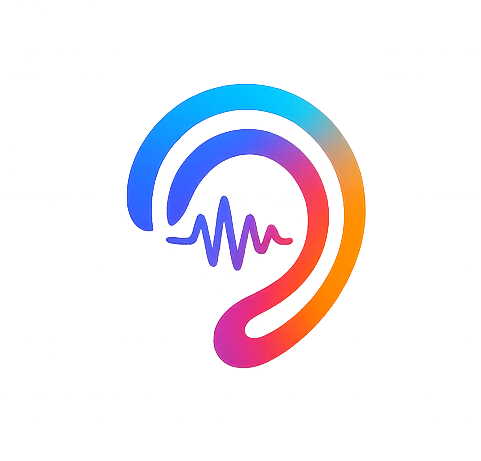

# OpenAuris



OpenAuris is an open-source, privacy-first dictation app for macOS that lets you control your computer with your voice. Currently focused on flawless dictation, with voice control features planned for future releases.

Designed as a lightweight Apple-native alternative to hosted whisper apps, OpenAuris offers local-only processing, global shortcuts, and a polished menu bar workflow for seamless voice-to-text transcription.

## 🎯 Current V1 Implementation

OpenAuris V1 delivers a complete dictation experience with these key features:

### 🎤 Dictation Core
- **Menu bar-first design** with quick-access dashboard window
- **Bottom-center listening bubble** with real-time status indicators
- **Flexible trigger modes**:
  - Hold-to-speak for quick dictation
  - Toggle start/stop for longer sessions

### 🤖 AI Processing
- **Local-only Whisper transcription** via WhisperKit integration
- **Model management UI** with automatic installation for default models
- **Per-session language control** with `auto` detect or explicit language override

### 📊 Productivity Features
- **Session history** with search and deletion capabilities
- **Comprehensive statistics**:
  - Total words transcribed
  - Session count tracking
  - Average words per minute (WPM)
  - Current streak counter
- **Achievement system** to motivate regular use:
  - First Session
  - 1,000 Words
  - 7-Day Streak
  - 25 Sessions
  - 10,000 Words

### 🔒 Privacy & Integration
- **Local-only storage** via SwiftData - your data never leaves your device
- **Accessibility-first text insertion** with intelligent paste fallback
- **App Intents shortcuts** for Apple Shortcuts automation
- **Global hotkeys** for instant access from any application

## 🚀 Future Roadmap

Our vision extends beyond dictation to full voice control:

### Upcoming Features
- **Voice commands** for system and application control
- **Custom command creation** for personalized workflows
- **Natural language processing** for contextual understanding
- **Multi-language support** for global accessibility

> ⚠️ **Note**: Voice control features will be implemented once dictation reaches flawless performance and stability.

## Whisper Runtime

`WhisperKitTranscriptionEngine` is the production runtime and requires WhisperKit.

To enable full WhisperKit transcription, add package dependency:

- Repository: `https://github.com/argmaxinc/WhisperKit.git`
- Product: `WhisperKit`

## Requirements

- macOS 26+
- Apple Silicon
- Xcode 26.2+

## Build

```bash
xcodebuild -project openauris.xcodeproj -scheme openauris -destination 'platform=macOS' -configuration Debug -derivedDataPath .build build
```

## Run

Build, then open the generated app bundle:

```bash
xcodebuild -project openauris.xcodeproj -scheme openauris -destination 'platform=macOS' -configuration Debug -derivedDataPath .build build
open .build/Build/Products/Debug/openauris.app
```

> Note: `xcodebuild` does not support a `run` build action in this setup. Launch with `open` after build.

## VS Code Tasks

The repository includes VS Code tasks in `.vscode/tasks.json`:

- `Build OpenAuris`: builds Debug using `-derivedDataPath .build`
- `Run OpenAuris`: depends on build, then launches `.build/Build/Products/Debug/openauris.app`
- `Run Tests`: runs `openaurisTests` using the same derived data path

## Test

```bash
xcodebuild -project openauris.xcodeproj -scheme openauris -destination 'platform=macOS' -configuration Debug -derivedDataPath .build -only-testing:openaurisTests test
```

UI smoke tests:

```bash
xcodebuild -project openauris.xcodeproj -scheme openauris -destination 'platform=macOS' -configuration Debug -derivedDataPath .build -only-testing:openaurisUITests/openaurisUITests test
```

## Docs

- [Architecture](docs/ARCHITECTURE.md)
- [Contributing](CONTRIBUTING.md)
